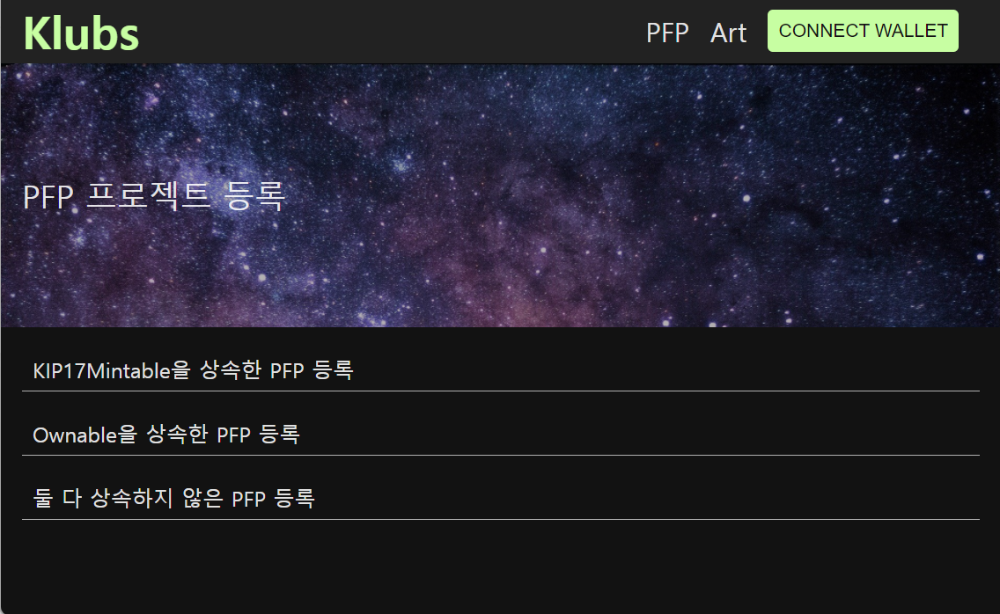

# PFP Registration

### **PFP 프로젝트 등록 화면**

PFP 프로젝트 등록 화면 접속 시, 아래와 같은 세가지 메뉴가 뜨게 됩니다.

Link - [http://klu.bs/pfp/add](http://klu.s/pfp/add)



1. [KIP-17 Mintable을 상속한 PFP 등록](https://klu.bs/pfp/add-by-minter)
```
pragma solidity ^0.5.6;

import "./klaytn-contracts/token/KIP17/KIP17Full.sol";
import "./klaytn-contracts/token/KIP17/KIP17Mintable.sol";
import "./klaytn-contracts/token/KIP17/KIP17Burnable.sol";
import "./klaytn-contracts/token/KIP17/KIP17Pausable.sol";

contract DogeSoundClubMate is KIP17Full("DOGESOUNDCLUB MATES", "MATE"), KIP17Mintable, KIP17Burnable, KIP17Pausable {

    string public hash = "6110b42d1575f2bfb80a98cb6ce7d6743fa249b6ee2be08467487c12f5f95753";
    string public ipfs = "QmfTimyAQTQjQsnvECn9U44LdnPzSDF2XREoP2WFdjHitQ";

    function tokenURI(uint256 tokenId) public view returns (string memory) {
        require(_exists(tokenId), "KIP17Metadata: URI query for nonexistent token");
        
        if (tokenId == 0) {
            return "https://api.dogesound.club/mate/0";
```

위와 같이 KIP-17 Mintable를 상속한 PFP 프로젝트의경우 선택하시면 됩니다.

반드시 Minter중 한 명의 지갑으로 계약 등록을 진행해야합니다.

트랜젝션이 발생한 이후 다음과 같은 메시지가 뜨게 된다면, 정상적으로 등록이 완료된 것입니다.


2. Ownable를 상속한 PFP 등록
```
pragma solidity ^0.5.6;

import "./klaytn-contracts/token/KIP17/IKIP17Enumerable.sol";
import "./klaytn-contracts/ownership/Ownable.sol";

contract CBKMint is Ownable {

    IKIP17Enumerable public nft;

    constructor(IKIP17Enumerable _nft) public {
        nft = _nft;
    }

    function mint(uint256 id) payable external {
        require(msg.value == 20 ether);
        nft.transferFrom(address(this), msg.sender, id);
        owner().transfer(msg.value);
    }
}
```

위와같이 Ownable를 상속한 PFP 프로젝트인 경우에 선택하는 메뉴입니다.

아래와 같은 계약 주소 입력칸이 뜨게되며 반드시 Owner 지갑으로 진행하셔야 합니다.

트랜잭션이 완료되고 다음과 같이 메시지가 뜨면, 정상적으로 등록이 완료된 것입니다.
3. [두가지 다 상속하지 않는 PFP 등록](http://klu.bs/pfp/propose)

KIP17Mintable나 Ownable을 상속하지 않은 경우에 선택하는 메뉴입니다. 둘 중 하나라도 상속한 경우 앞의 2개의 메뉴를 선택하시기 바랍니다.

아래와 같은 계약 주소 입력칸이 뜨게되며 반드시 계약 배포자의 지갑으로 진행하셔야 합니다.
